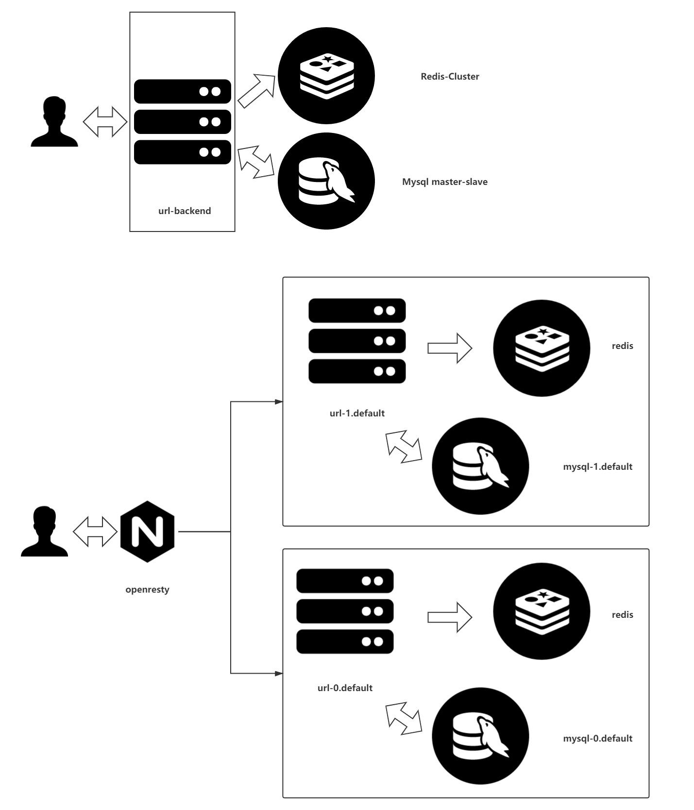

# 短链接

## 架构



一共做了两套架构

1. redis、mysql作为独立的服务存在，redis-cluster内部进行sharding的处理，mysql仅做主从（mysql做sharding，没看见什么好用的），但是因此autoscaling会有很大的问题，比如什么时候scale，resharding对于服务的影响，resharding错误该如何回滚，对于性能的影响有多大。此架构下，能建议autoscaling的之后backend
2. redis mysql backend三者打包进行autoscaling，且mysql仍旧可以做主从。此时使用openresty进行业务逻辑层次的sharding。backend仍旧在deployment层次上自主进行相应的autoscaling，而mysql则是依靠statefulset的控制进行autoscaling

本repo主要为提供第二种结构而存在，创建”具有状态“的部署模式。增加数据量维度的scaling。但是不能够进行缩容和合并，相应理由同上。

## build方法

使用阿里云构建，在对应的commit上打上release-v{n}即可在阿里云上自动构建。

## 相关接口

```bash
curl http://ip:9090/scaleUp?index=n
```

将会生成

1. url backend+redis的deployment&service
2. mysql statefulset & service mysql-0.default

这里通过config将会保证url-0下的任何backend将使用的是mysql-0.default。

TODO: 对于mysql扩容没有太大的问题（仍旧是主从那一套），但是读写分离现在对于golang部分的业务逻辑没有扩展。

